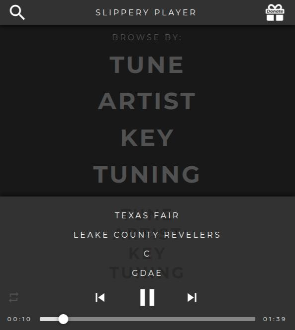

A webplayer created to consume scraped fiddle tune data and audio files from Slippery-Hill.com, an educational resource and non-profit dedicated to the preservation and cataloging of fiddle tunes, to provide an interface to search, browse, and listen to fiddle tunes.

https://slippery.erichkopp.com

